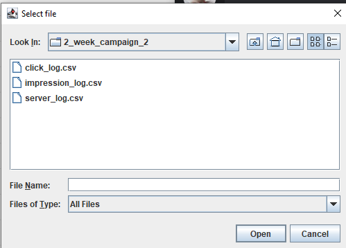

# comp2211

## Documentation

### Minimum system specs:

Intel Core i3 or Ryzen 3 3100

8 GB RAM

60 MB of free space on disk

### Recomeded specs:

16 GB or mpre of ram is favored when large datasets are handled

Application use:

download the jar and run it through cmd in the same directory using the command:    
 `java -jar adda.jar`  

once the program is running, login and use the file tab in the top write to select the various csvs that contain the data  

  

Load the file in the order *click_log, impression_log, server_log*  
**The files must be loaded in this precise order or else the program will fail**  
*there is a known bug with cancelling during file exploration if you accidentally cancel during search click on the file tab again*

Click on the load data and different metrics and their graphs should generate in the main section in the middle  
*if the bottom timescale doesn't load properly click on the load data button again to clear it*

on the left sidebar there is the time frame scale    

  

this will adjust the scope of what the graphs cover 
below this are the various graphs that you can view data for

load any of these views just select a time scale at the bottom dropdown and click on one of the data fields